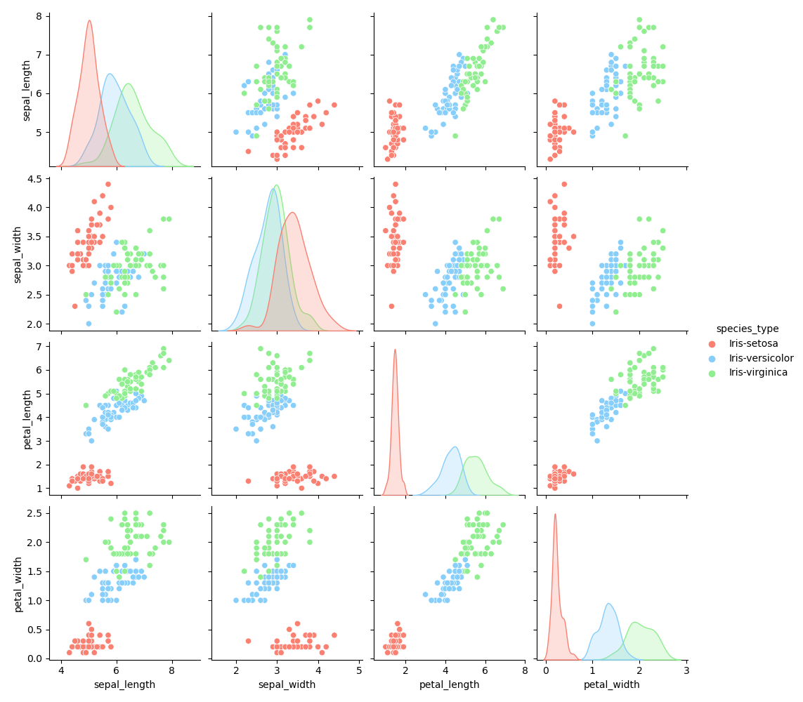

# 23-24: 8632 -- PROGRAMMING AND SCRIPTING. 

# Introduction

This repository contains the final project for the Programming and Scripting (23-24: 8632 -- PROGRAMMING AND SCRIPTING) module for the Higher Diploma in Science in Data Analytics at Atlantic Technological University.

# Instructions

This project contains an executable Python file which will produce text and image files summarising and visualising the variables of the Iris dataset. 

To run this file, navigate to the `pands-project` directory and run the following code: 

``` python 
python analysis.py
```

The script will look for the Iris dataset in a file called `iris.data` in the subdirectory `data`. It will create subdirectories called `summary` and `plots`, if they don't already exist, along with some further subdirectories for the output files. 

You will need a modern version of Python installed on your machine to run this code. To install Python, you can download a copy of Python from [Python.org](https://www.python.org/) or download a more full-featured collection of Python-related programs from [Anaconda.com](https://www.anaconda.com/).

# Code Overview

The `analysis.py` script performs the following tasks:
1. Creates the required subdirectories for the output files, if necessary.
2. Reads in the Iris dataset. 
3. Writes the first five rows of data along with some summary statistics to a text file.
4. Creates a pair plot of numerical variables and outputs it as a `.png` file. 
5. Creates a histogram for each numerical variable and outputs them as `.png` files. 
6. Creates a scatter plot for each pair of numerical variables and outputs them as `.png` files. 
7. Creates a KDE plot for each numerical variable and outputs them as `.png` files. 
8. Creates a Pearson correlation matrix for numerical variables and outputs it as a `.md` file. 
9. Creates Pearson correlation matrices for numerical variables broken out by species and outputs them as `.md` files.

# Iris Dataset Overview

The Iris dataset is a famous collection of data often used to demonstrate statistical and machine learning concepts. It contains the measurements of fifty samples of three species of Iris flower and was popularised by statistician and biologist Ronald Fischer through his work on linear discriminant analysis, although the data was originally collected by botanist Edgar Anderson in the Gaspé Peninsula. 

The three species of flowers examined in the dataset are:
* Iris setosa 
* Iris virginica 
* Iris versicolor

The measurements collected are:
* Length of sepal
* Width of sepal
* Length of petal 
* Width of petal

# Summary of Variables

The `summary/iris_summary.txt' contains a summary of the variables contained within the dataset. From this, we can draw some initial conclusions. 

In general, the lengths of the sepal and petals are greater than their widths, with sepal and petal length means of 5.84cm and 3.76cm and width means of 3.05cm and 1.20cm respectively. Similarly, we can draw from this that sepals and generally longer than petals, although petals have higher standard deviations than sepals despite their shorter mean lengths, with sepal and petal length standard deviations of 0.83cm and 1.76cm and width standard deviations of 0.43cm and 0.76cm respectively.

Looking at the medians and modes, we can see that the sepal and petal lengths have medians of 5.80 and 4.35, the sepal and petal widths have medians of 3.00 and 1.30, the sepal and petal lengths have modes of 5.0 and 1.5 and sepal and petal widths have modes of 3.0 and 0.2. An interesting observation here is that the sepals have medians that are relatively similar to their modes, implying a symmetrical distribution. The petals on the other hand have medians that are quite different from their modes, implying a lack of symmetry in their distributions. 

# Visual Analysis

Charts provide a visual way of analysing a dataset, and can provide insights that might otherwise be difficult to infer. There are a number of different charts that we can use to represent the variables in the Iris dataset. The ones that we will examine are histograms, KDE plots, scatter plots, and a pair plot. 

## Histograms

Histograms are used to display continuous data. Values are grouped into buckets, which are represented on the x-axis, and each occurrence of a value in a particular bucket (range) is represented by a unit on the y-axis. 

We have four continuous variables in our data (sepal_length, sepal_width, petal_length, and petal_width) and we can examine them next to each other on a 2x2 grid. 

<p align="center">
  
  
</p>
<p align="center">
  
  
</p>

From this visual representation, we can confirm our earlier conclusion that the distributions of the sepal lengths and widths are more symmetrical than those of the petals. From looking at the petal distributions, it's clear that there is some factor that is responsible for the grouping of data observations. Standard histograms treat all values the same, and while it is possible to add hues to represent multiple dimensions within the data, there are other charts that perform a similar analysis but allow for more effectively visualising multiple dimensions. 

## KDE Plots

KDE (Kernel Density Estimation) plots are analogous to histograms in that they represent the distribution of values in a dataset, but their methods of representation are very different. A KDE plot visualises the continuous probability density curve of a variable, and since multiple curves can be easily displayed overlapping on a single plot, we can separate variables into different dimensions and display their continuous probability density curves on one plot using colour to distinguish them. In our case, we will examine four plots (one for each measurement type) and separate the plots into three dimensions (one for each species type). 

<p align="center">
  
  
</p>
<p align="center">
  
  
</p>

From this view, we can clearly see how the distributions of the lengths and widths are different depending on the species type. If we focus on petal_length, we can see how the Iris-setosa is responsible for the dense grouping of values in the 1-2cm range, and Iris-versicolor and Iris-virginica correspond with the two other peaks. Similar groups of density can be seen in the other measurements, which were not as obvious with histograms. While histograms and KDE plots allow us to examine the distribution of individual variables, they don't tell us anything about the relationships between variables. Other charts such as scatter plots and pair plots can provide this information.  

## Scatter Plots & Pair Plots

Scatter plots visualise the relationship between two numerical variables. Observations are plotted as points on a two-dimensional cartesian plane, with one variable represented by the x-axis and another variable represented on the y-axis. A third, categorical variable, can be represented by the colour of each point. 

In our case, we will plot each ordered pair of variables. Since we have 12 pairs of ordered variables, we could display these plots on a 6x2 grid, similar to how we displayed 2x2 grids of histograms and KDE plots. 

<p align="center">
  
  
</p>
<p align="center">
  
  
</p>
<p align="center">
  
  
</p>
<p align="center">
  
  
</p>
<p align="center">
  
  
</p>
<p align="center">
  
  
</p>

An alternative way to display groups of related scatter plots, however, is through a pair plot, which plots scatter plots of all pairs of variables on one graph along with their corresponding KDE plots. Each scatter plot and its inverse is displayed symmetrically across the top left to bottom right diagonal. 

<p align="center">
  
</p>

In this representation, we sacrifice some of the detail available with larger individual plots, such as the y-axis scale of the KDE plots or the ease of distinguishing some of the scatter plot points. What we gain, however, is a birds-eye view of the density of our variables and the correlation between them, which can be extremely useful for spotting patterns and relationships.

An interesting observation that can be inferred from this view is that as petal_length increases, so does sepal_length, petal_width, and to a lesser extent sepal_width, but only for Iris-versicolor and Iris-virginica. While Iris-setosa does have variation in some variables such as sepal_width and sepal_length, there appears to be little positive or negative correlation between sepal_length and any other variable for Iris-setosa.  This corresponds with the large spikes in density that can be seen on the KDE plot for petal_length. While correlation may be apparent from viewing these plots, to verify it we'll need to perform a statistical test. 

# Correlation

There are various statistical tests we can perform to measure the correlation between two variables. One common way is to calculate the Pearson correlation coefficient, which measures the strength of the linear relationship between two variables. A Pearson correlation coefficient of 1 indicates a perfect linear relationship, -1 indicates a perfect negative relationship, and 0 indicates no correlation between the variables. We'll first examine a correlation matrix which shows the correlation between variables regardless of species. 

<div align="center">

|              |   sepal_length |   sepal_width |   petal_length |   petal_width |
|:-------------|---------------:|--------------:|---------------:|--------------:|
| sepal_length |       1        |     -0.109369 |       0.871754 |      0.817954 |
| sepal_width  |      -0.109369 |      1        |      -0.420516 |     -0.356544 |
| petal_length |       0.871754 |     -0.420516 |       1        |      0.962757 |
| petal_width  |       0.817954 |     -0.356544 |       0.962757 |      1        |

</div>

This table is analogeous to our pair plot above (excluding the species dimensionality), except that rather than inferring the correlation between two variables by how linear the relationship seems, we can see the correlation coefficient between the two variables.  A correlation coefficient of 0.96 between petal_width and petal_length, for instance, implies strong linearity, which corresponds with the visual representation in the scatter plot above. 

To verify our earlier observation regarding the difference in correlation between petal_length and sepal_length, petal_length, and petal_width depending on species type, we'll need to examine the correlation matrices of each species. 

### Iris-setosa

<div align="center">

|                     |   sepal_length_setosa |   sepal_width_setosa |   petal_length_setosa |   petal_width_setosa |
|:--------------------|----------------------:|---------------------:|----------------------:|---------------------:|
| sepal_length_setosa |              1        |             0.74678  |              0.263874 |             0.279092 |
| sepal_width_setosa  |              0.74678  |             1        |              0.176695 |             0.279973 |
| petal_length_setosa |              0.263874 |             0.176695 |              1        |             0.306308 |
| petal_width_setosa  |              0.279092 |             0.279973 |              0.306308 |             1        |

</div>

### Iris-versicolor

<div align="center">

|                         |   sepal_length_versicolor |   sepal_width_versicolor |   petal_length_versicolor |   petal_width_versicolor |
|:------------------------|--------------------------:|-------------------------:|--------------------------:|-------------------------:|
| sepal_length_versicolor |                  1        |                 0.525911 |                  0.754049 |                 0.546461 |
| sepal_width_versicolor  |                  0.525911 |                 1        |                  0.560522 |                 0.663999 |
| petal_length_versicolor |                  0.754049 |                 0.560522 |                  1        |                 0.786668 |
| petal_width_versicolor  |                  0.546461 |                 0.663999 |                  0.786668 |                 1        |

</div>

### Iris-virginica

<div align="center">

|                        |   sepal_length_virginica |   sepal_width_virginica |   petal_length_virginica |   petal_width_virginica |
|:-----------------------|-------------------------:|------------------------:|-------------------------:|------------------------:|
| sepal_length_virginica |                 1        |                0.457228 |                 0.864225 |                0.281108 |
| sepal_width_virginica  |                 0.457228 |                1        |                 0.401045 |                0.537728 |
| petal_length_virginica |                 0.864225 |                0.401045 |                 1        |                0.322108 |
| petal_width_virginica  |                 0.281108 |                0.537728 |                 0.322108 |                1        |

</div>
<br />

We're presented with a lot of information here, but we can cherry-pick the pieces we need. From the pair plot, it appeared that Iris-setosa petal_length had a weak linear relationship with the other variables. We can read from the Iris-setosa table that its petal_length has a Pearson correlation coefficient of 0.26, 0.18, and 0.31 with sepal_length, petal_length, and petal_width respectively. These relatively low values confirm our earlier observations of weak correlation. 

Iris-versicolor petal_length on the other hand, has correlation coefficients of 0.75, 0.56, and 0.79 with sepal_length, petal_length, and petal_width, and Iris-virginica petal_length has correlation coefficients of 0.86, 0.40, and 0.32 with sepal_length, petal_length, and petal_width respectively. These generally higher correlation coefficients indicate a stronger linear relationship between petal_length and the other variables for Iris-versicolor and Iris-virginica, confirming our earlier observations.

# Conclusion

In conclusion, we've used various summary statistics, charts, and tests to investigate the Iris dataset and uncover some insights and relationships between the variables, such as the relative symmetry of distribution of the sepal measurements vs the petal measurements, the effect that species type has on probability density, and the how the correlation of variables changes depending on species type. 

# References

## General

- [https://en.wikipedia.org/wiki/Iris_flower_data_set](https://en.wikipedia.org/wiki/Iris_flower_data_set)
- [https://www.geeksforgeeks.org/exploratory-data-analysis-on-iris-dataset/](https://www.geeksforgeeks.org/exploratory-data-analysis-on-iris-dataset/)
- [https://www.kaggle.com/code/lalitharajesh/iris-dataset-exploratory-data-analysis](https://www.kaggle.com/code/lalitharajesh/iris-dataset-exploratory-data-analysis)
- [https://www.statistics.com/historical-spotlight-iris-dataset/](https://www.statistics.com/historical-spotlight-iris-dataset/)
- [https://courses.lumenlearning.com/introstats1/chapter/skewness-and-the-mean-median-and-mode](https://courses.lumenlearning.com/introstats1/chapter/skewness-and-the-mean-median-and-mode)
- [https://statisticsbyjim.com/basics/histograms/](https://statisticsbyjim.com/basics/histograms/)
- [https://en.wikipedia.org/wiki/Kernel_density_estimation](https://en.wikipedia.org/wiki/Kernel_density_estimation)
- [https://en.wikipedia.org/wiki/Scatter_plot](https://en.wikipedia.org/wiki/Scatter_plot)
- [https://www.analyticsvidhya.com/blog/2024/02/pair-plots-in-machine-learning/](https://www.analyticsvidhya.com/blog/2024/02/pair-plots-in-machine-learning/)
- [https://machinelearningmastery.com/how-to-use-correlation-to-understand-the-relationship-between-variables/](https://machinelearningmastery.com/how-to-use-correlation-to-understand-the-relationship-between-variables/)

## Code

- [https://realpython.com/python-f-strings/](https://realpython.com/python-f-strings/)
- [https://realpython.com/pandas-python-explore-dataset/](https://realpython.com/pandas-python-explore-dataset/)
- [https://pandas.pydata.org/pandas-docs/stable/reference/api/pandas.read_csv.html](https://pandas.pydata.org/pandas-docs/stable/reference/api/pandas.read_csv.html)
- [https://www.w3schools.com/python/python_file_write.asp](https://www.w3schools.com/python/python_file_write.asp)
- [https://realpython.com/defining-your-own-python-function/](https://realpython.com/defining-your-own-python-function/)
- [https://www.geeksforgeeks.org/python-for-loops/](https://www.geeksforgeeks.org/python-for-loops/)
- [https://seaborn.pydata.org/generated/seaborn.pairplot.html](https://seaborn.pydata.org/generated/seaborn.pairplot.html)
- [https://seaborn.pydata.org/generated/seaborn.histplot.html](https://seaborn.pydata.org/generated/seaborn.histplot.html)
- [https://seaborn.pydata.org/generated/seaborn.scatterplot.html](https://seaborn.pydata.org/generated/seaborn.scatterplot.html)
- [https://www.w3schools.com/python/matplotlib_labels.asp](https://www.w3schools.com/python/matplotlib_labels.asp)
- [https://www.atlassian.com/data/notebook/how-to-save-a-plot-to-a-file-using-matplotlib](https://www.atlassian.com/data/notebook/how-to-save-a-plot-to-a-file-using-matplotlib)
- [https://www.geeksforgeeks.org/python-pair-iteration-in-list/](https://www.geeksforgeeks.org/python-pair-iteration-in-list/)
- [https://seaborn.pydata.org/generated/seaborn.kdeplot.html](https://seaborn.pydata.org/generated/seaborn.kdeplot.html)
- [https://www.geeksforgeeks.org/seaborn-kdeplot-a-comprehensive-guide/](https://www.geeksforgeeks.org/seaborn-kdeplot-a-comprehensive-guide/)
- [https://seaborn.pydata.org/tutorial/color_palettes.html](https://seaborn.pydata.org/tutorial/color_palettes.html)
- [https://seaborn.pydata.org/generated/seaborn.kdeplot.html](https://seaborn.pydata.org/generated/seaborn.kdeplot.html)
- [https://pandas.pydata.org/docs/reference/api/pandas.DataFrame.corr.html](https://pandas.pydata.org/docs/reference/api/pandas.DataFrame.corr.html)
- [https://pandas.pydata.org/docs/reference/api/pandas.DataFrame.drop.html](https://pandas.pydata.org/docs/reference/api/pandas.DataFrame.drop.html)
- [https://www.geeksforgeeks.org/ways-to-filter-pandas-dataframe-by-column-values/](https://www.geeksforgeeks.org/ways-to-filter-pandas-dataframe-by-column-values/)
- [https://pandas.pydata.org/docs/reference/api/pandas.DataFrame.to_markdown.html](https://pandas.pydata.org/docs/reference/api/pandas.DataFrame.to_markdown.html)
- [https://realpython.com/numpy-scipy-pandas-correlation-python/](https://realpython.com/numpy-scipy-pandas-correlation-python/)
- [https://www.geeksforgeeks.org/exploring-correlation-in-python/](https://www.geeksforgeeks.org/exploring-correlation-in-python/)
- [https://realpython.com/list-comprehension-python/](https://realpython.com/list-comprehension-python/)
